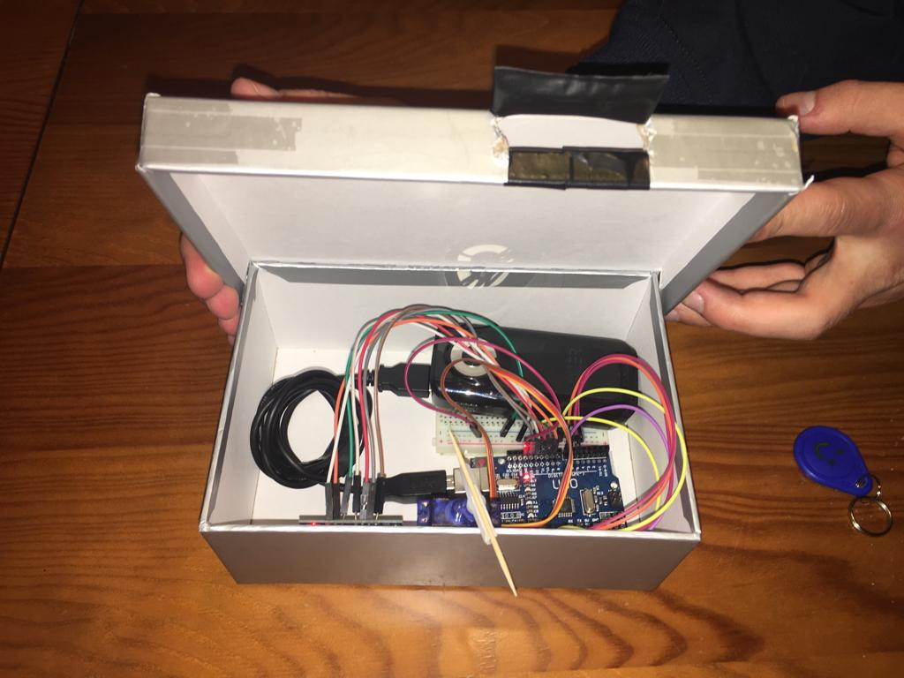
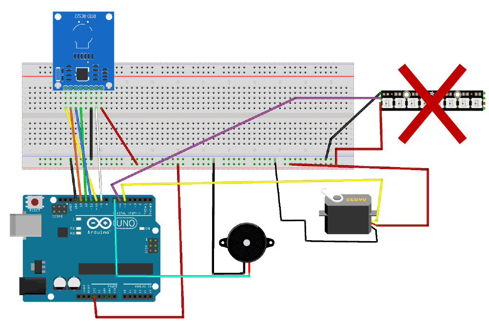

# RFID Smart Lock Arduino Safe Box Concept

**Proof of concept of an Arduino based system for a safe box with RFID authentication.**

---
This project is a proof of concept of what a Arduino based system of a safe box with an RFID smart lock could be.

---

* The RFID system is programmed to know which users have access to the box and which users have not.
* It also make a different sound when the RFID card is not authorized
  * The buzzer makes 3 beeps when **denying** access.
  * Makes 2 beeps when the RFID card is **authorized**.

**Components used:**
* Arduino UNO & Genuino UNO
* RFID RC522
* Buzzer
* Jumper wires (generic)
* Breadboard (generic)
* Servos (Tower Pro SG90)
* Cables
* Power Supply (Used a PowerBank)
* Cardboard box

---
**Project Scheme**
Only the led strip was not implemented.

---

**More photos of the finished project inside the folder /Photos.**

**Also there is a Youtube video showing the project working.**

* **Youtube Video Link: https://www.youtube.com/watch?v=qQMk2eY3swI**

---
Made By Pedro Gomes & Tiago Grilo, 2019
